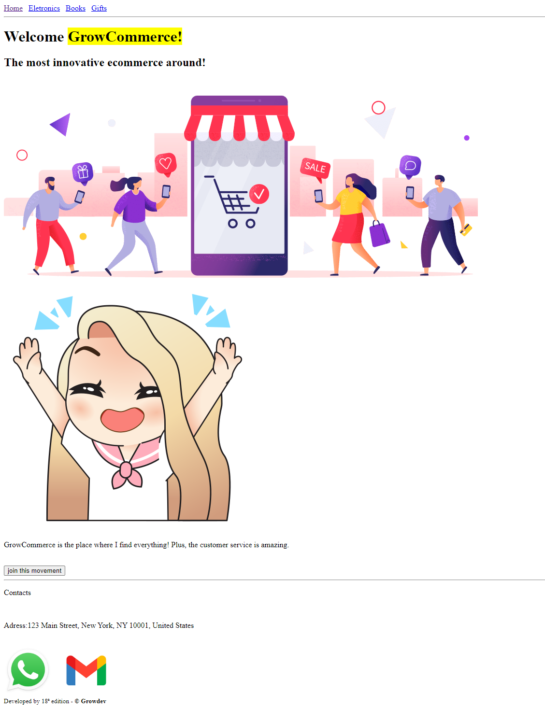

## GROW - COMMERCE

Projeto desenvolvido em grupos utilizando tags semanticas pela 18ª edição.

<h6>GRUPO 1: </h6>

<ul>
    <li>Adriano Santos</li>
    <li>Henrique</li>
    <li>Talia</li>
    <li>Mateus</li>
    <li>Wilson</li>
</ul>

<h6>GRUPO 2: </h6>

<ul>
    <li>Adriano Fernandes</li>
    <li>Douglas</li>
    <li>Gabriel</li>
    <li>João</li>
    <li>Rafael</li>
</ul>

<h6>GRUPO 3: </h6>

<ul>
    <li>Dionata</li>
    <li>Eduardo</li>
    <li>Hugo</li>
    <li>Yuri</li>
    <li>Michael</li>
</ul>

<h6>GRUPO 4: </h6>

<ul>
    <li>Dioni</li>
    <li>Cristiane</li>
    <li>Eder</li>
    <li>Luciano</li>
    <li>Valquíria</li>
  </ul>

 

# Apresentação 

 

# Link

<a href="https://anderwll.github.io/grow-commerce/" target="_blank">Grow Commerce</a>
